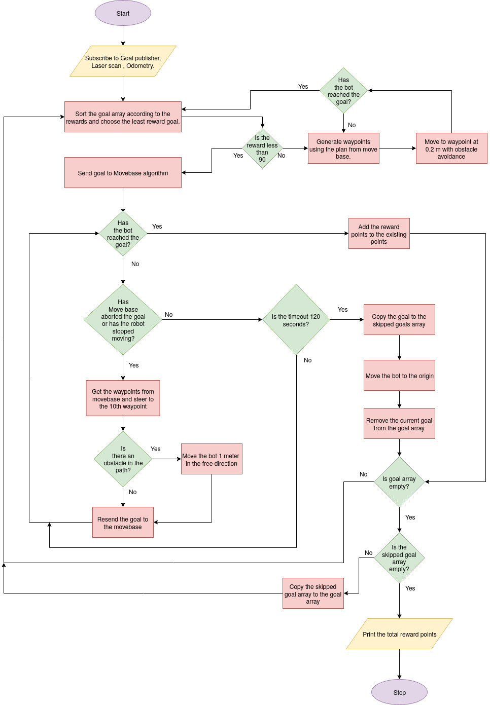
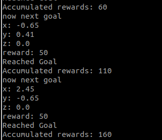

# Robot-Path-Planning

# Team Name
Potterheads

# Team Members
1. Adithya Sabarish Saravanan - @as-192154;
      Matriculation Number: 32979.
   
2. Arulious Jora Antony Raj Sathish- @aa-192228;
      Matriculation Number: 33048.

# Objective
The aim of the project, in simple words, is to make the turtlebot reach each goal point collecting the rewards at those points while avoiding the obstacles at the same time.

# Task Description
Harry_potter (we have named our turtlebot Harry Potter ;) ) is initially placed at the start point. There are many rewards placed at various points which are called the goal points. The GoalPublisher publishes all these goal points and the rewards available at the corresponding points. Harry has to reach the goal points collect the rewards at those points and move to the next. Thus Harry has to traverse the whole map collecting rewards while at the same time avoiding obstacles at this path. For obstacle avoidance, it can use the laser values which are published by the Laserscan. Also Harry can be moved using MoveBase which creates a path for him to move to every goal.

# Algorithm Description

## Choosing the next goal
Initilly the goals points and the rewards are obtained by subscribing to the GoalPublisher. The goals are then sorted in the ascending order of the reward values. The goal points with the least reward value i.e., the first element in the sorted array, is chosen and provided as the next goal to harry_potter. 

## Moving harry_potter
The next goal is given as the input to the MoveBase algorithm. The MoveBase algorithm works in such a way that if a goalpoint is sent as its input, it will steer and drive the turtlebot to that point. This travel path of the bot is defined using waypoints which are distanced at 0.025 metres each. Hence when the next goal is given as the input to the MoveBase algorithm, it steers harry_potter towards the goal by generating the wavpoints. Harry_potter can move linearly when the linear velocity is given in the x-direction and can rotate when the angualr velocity is given in the z-direction. 

## Obstacle avoidance
Harry_potter subsribes to the LaserScan values which are the output obtained from the laser sensor. Using the returned value from the sensor the presence of any obstacle at any distance can be determined. If harry_potter faces any obstacle in front of it, it scans the sides for obstacles. When it finds out the side without obstacles for a distance of 0.3 metres, then harry_potter rotates in that direction and moves for 1 meter in teh same direction in the absence of further obstacles.

## Algorithm Explanation

Harry_potter sorts the goal as soon as it is launched and starts moving towards the goal with the least reward. Whenever it faces an obstacle, it avoids the obstacle and starts moving towards teh same goal with the help of MoveBase algorithm.

There may be instances when the MoveBase algorithm itself may abort the goal or harry_potter would have stopped moving. In such cases, the waypoints are obtained from the MoveBase algorithm and harry_potter is driven manually to the 10th waypoint (at a distance of 0.25 m from harry_potter). After this, the goal point is resend to the MoveBase algorithm after checkinmg for obstacles. 

The algorithm is designed in such a way that if harry_potter takes more than 120 seconds to reach a goal, it is aborted, removed from the goal points array and is stored in the skipped goals array. After this the goal with the least reward point in the goal point array is chosen as the next goal and the process continues. Whenever a goal is skipped, harry_potter is moved to the origin and recentered. 

Incase the reward value at the next goal from the goal point array has a reward value over 90 points, then MoveBase algorithm is not employed to move harry_potter. Instead, the waypoints from the algorithm are extracted and harry_potter is moved manually along those waypoints while at the same time avoiding obstacles. 

## Final output

After all the goals available in the goal points array are reached, the goals from the skipped goals array are attempted. Whenever a goal is reached, harry_potter counts the rewards and adds it to the existing value. Once all the goals are reached and no more goal is left in the skipped goals array, harry_potter prints the total value of the reward points. 

